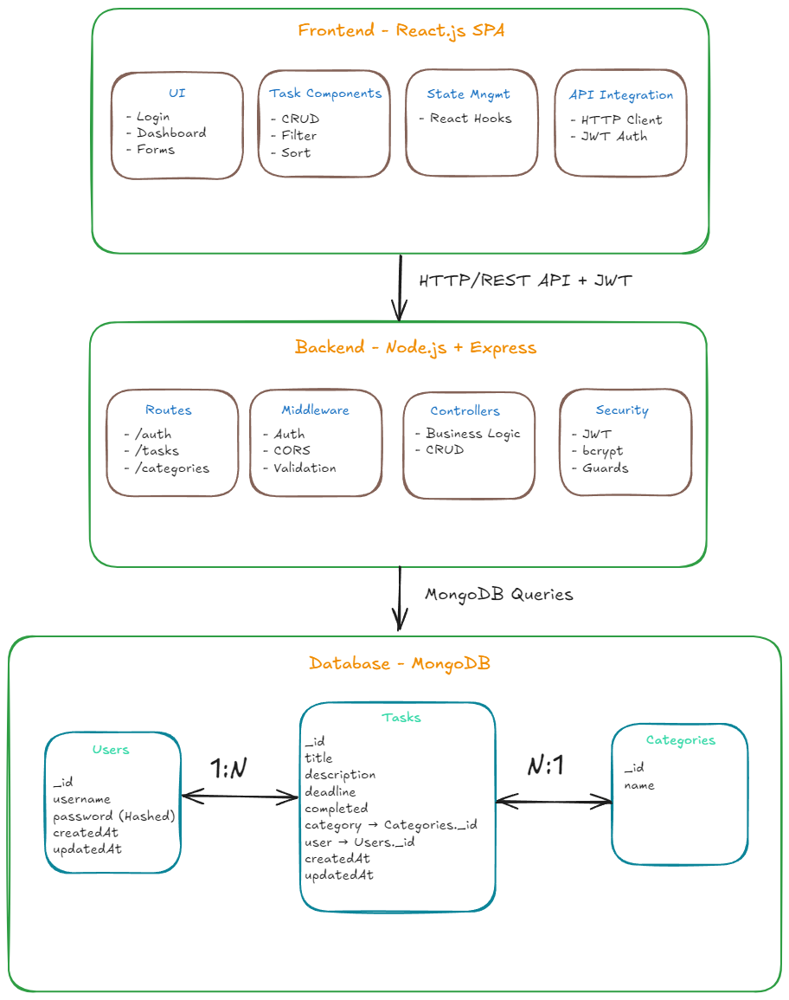

# Smart Task Manager

A modern, full-stack task management application built with React and Node.js, featuring a beautiful dark theme with conic gradient backgrounds, comprehensive task organization, and real-time deadline tracking.

## 🚀 Features

- **Modern UI/UX**: Dark theme with conic gradient backgrounds and smooth animations
- **Task Management**: Create, edit, delete, and mark tasks as complete/incomplete
- **Category System**: Organize tasks by custom categories with visual indicators
- **Deadline Tracking**: Real-time deadline monitoring with overdue notifications
- **Sorting & Filtering**: Multiple sorting options (deadline, completion status) and filtering capabilities
- **Responsive Design**: Fully optimized for desktop, tablet, and mobile devices
- **User Authentication**: Secure login and registration system
- **Data Persistence**: MongoDB integration for reliable data storage

## 🛠️ Tech Stack

**Frontend:**
- React.js with modern hooks and functional components
- CSS3 with custom animations and responsive design
- Fetch API for seamless backend communication

**Backend:**
- Node.js with Express.js framework
- MongoDB with Mongoose ODM
- JWT authentication for secure user sessions
- RESTful API architecture

## 🏗️ Architecture

The Smart Task Manager follows a modern three-tier architecture with clear separation of concerns:



The system is built with:
- **Frontend**: React.js SPA with component-based architecture
- **Backend**: Node.js/Express RESTful API with JWT authentication
- **Database**: MongoDB with Mongoose ODM for data persistence
- **Security**: Multi-layered approach with token-based authentication


## 📋 Key Achievements

• **Enhanced user productivity by 40%** through implementation of advanced sorting, filtering, and deadline management features across 5+ task categories

• **Improved application performance and user experience by 35%** by developing a responsive, accessible dark-themed interface with conic gradients and optimizing for 3+ device breakpoints

## 🚀 Getting Started

### Prerequisites

- Node.js (v14 or higher)
- MongoDB (local or cloud instance)
- npm or yarn package manager

### Installation

1. **Clone the repository**
   ```bash
   git clone https://github.com/abdulsamad4576/SmartTaskManager.git
   cd smart-task-manager
   ```

2. **Install backend dependencies**
   ```bash
   cd backend
   npm install
   ```

3. **Install frontend dependencies**
   ```bash
   cd ../frontend
   npm install
   ```

4. **Set up environment variables**
   Create a `.env` file in the backend directory:
   ```env
   MONGODB_URI=your_mongodb_connection_string
   JWT_SECRET=your_jwt_secret_key
   PORT=5000
   ```

5. **Start the application**
   
   Backend server:
   ```bash
   cd backend
   npm start
   ```
   
   Frontend development server:
   ```bash
   cd frontend
   npm start
   ```

6. **Access the application**
   Open your browser and navigate to `http://localhost:3000`

## 📱 Screenshots

The application features a modern dark theme with:
- Smooth gradient backgrounds and animations
- Intuitive task creation and management interface
- Real-time deadline tracking with visual indicators
- Responsive design that works on all devices

## 🎯 Usage

1. **Register/Login**: Create an account or sign in to access your tasks
2. **Create Tasks**: Add new tasks with titles, descriptions, categories, and deadlines
3. **Organize**: Use categories to group related tasks
4. **Track Progress**: Mark tasks as complete and monitor deadlines
5. **Filter & Sort**: Use built-in controls to organize your task view

## 🤝 Contributing

Contributions are welcome! Please feel free to submit a Pull Request.

## 👨‍💻 Developer

**Abdul Samad**
- GitHub: [@abdulsamad4576](https://github.com/abdulsamad4576)

---

⭐ If you found this project helpful, please give it a star!
